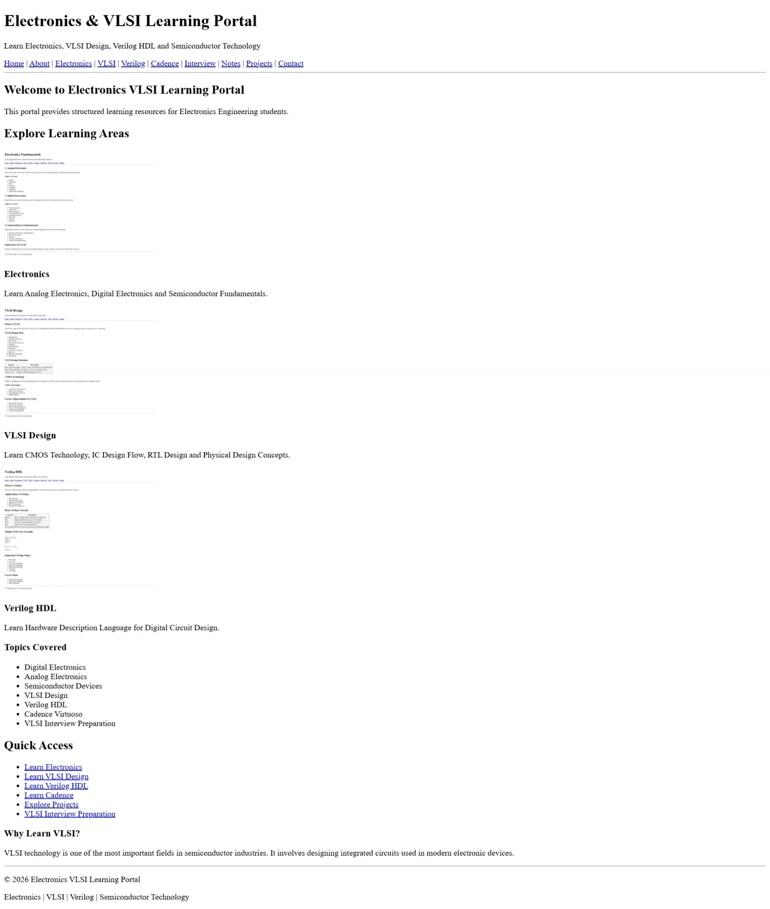
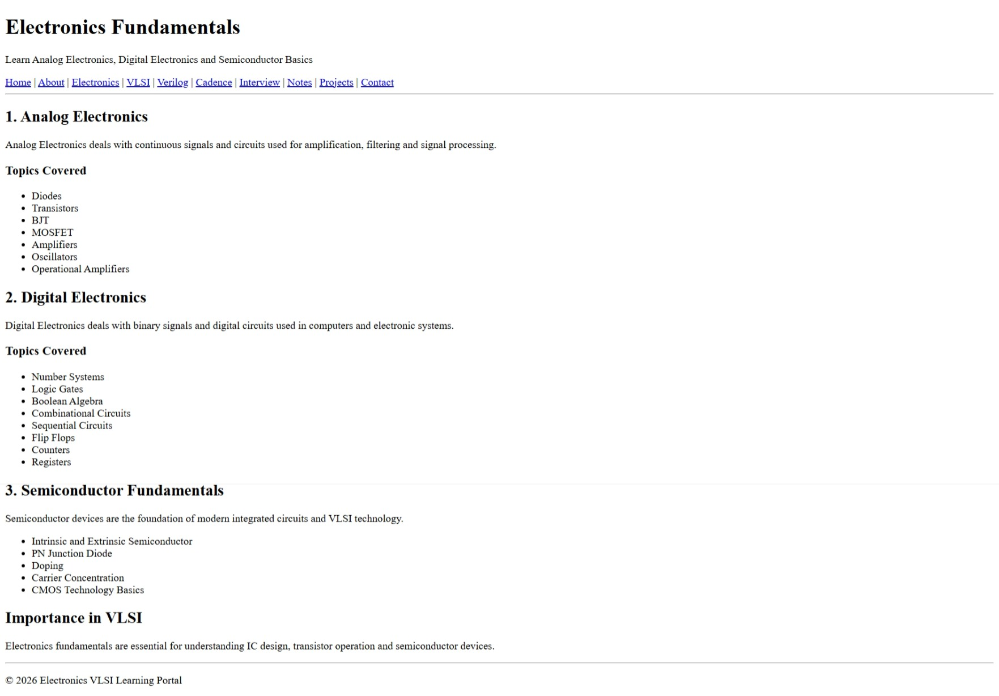
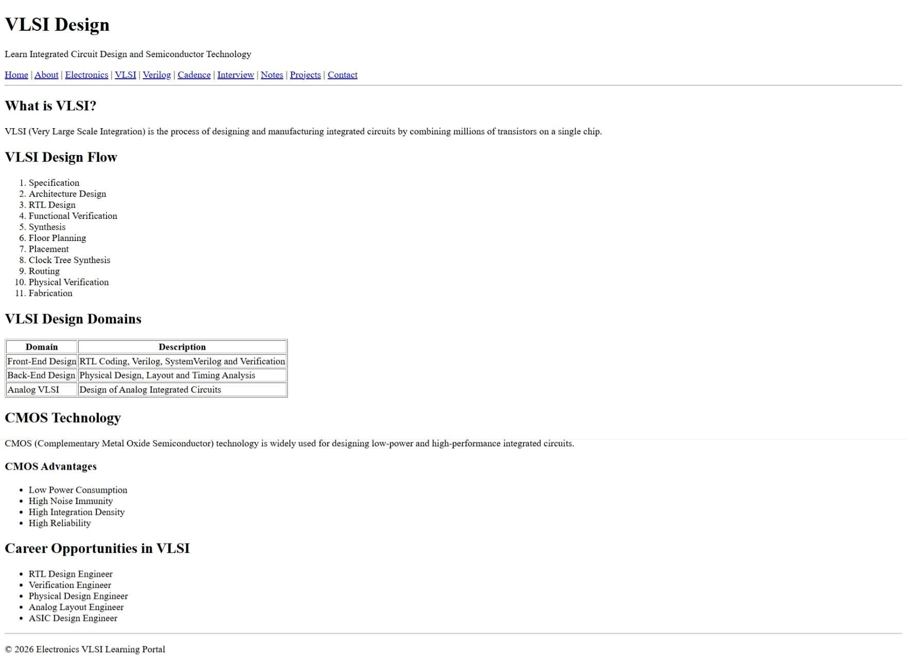
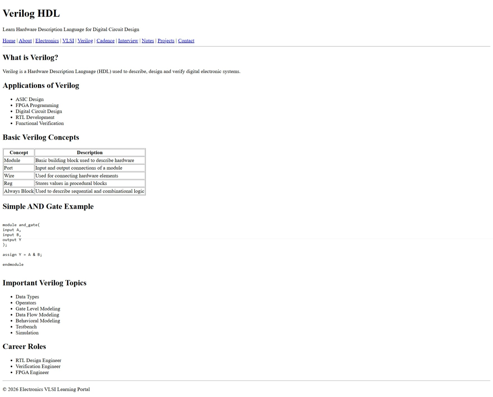
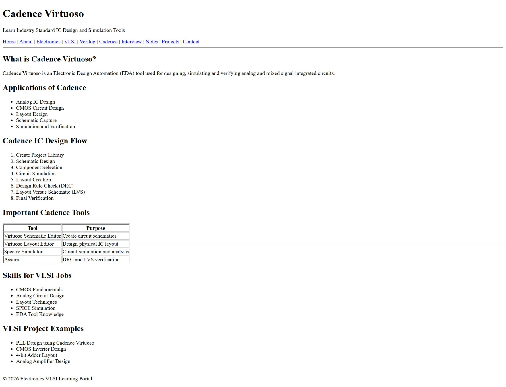

# 🚀 Electronics-VLSI-Learning-Portal


> 📚 **An Educational HTML5 Website for Electronics & VLSI Learning**

---

# 📌 Project Description

The **Electronics-VLSI-Learning-Portal** is an educational website developed using **HTML5**.

It provides structured learning resources for **Electronics Engineering students**, covering:

- 📘 Digital Electronics
- ⚡ Analog Electronics
- 💻 VLSI Design
- 🔷 Verilog HDL
- 🛠️ Cadence Virtuoso
- 🎯 Interview Preparation
- 📂 Projects

---

# 🎯 Objective

The main objective of this project is to create a simple learning platform for students interested in:

- 📖 Electronics Fundamentals
- 💎 Semiconductor Technology
- 💻 VLSI Design
- 🔷 Hardware Description Language
- ⚙️ IC Design Tools

---

# 🛠️ Technologies Used

| Technology | Description |
|------------|-------------|
| 🌐 HTML5 | Structure of the Website |

---

# ⭐ Features

- ✅ Multi-page Educational Website
- ✅ Electronics Learning Section
- ✅ VLSI Design Concepts
- ✅ Verilog HDL Basics
- ✅ Cadence Virtuoso Information
- ✅ VLSI Interview Questions
- ✅ Notes & Resources
- ✅ Project Showcase
- ✅ Contact Page

---

# 📂 Project Structure

```text
Electronics-VLSI-Learning-Portal/

│── index.html
│── about.html
│── electronics.html
│── vlsi.html
│── verilog.html
│── cadence.html
│── interview.html
│── notes.html
│── projects.html
│── contact.html
│
│── images/
│
│── output.png
│
└── README.md
```

---

# 📚 Learning Modules

## ⚡ Electronics

- Analog Electronics
- Digital Electronics
- Semiconductor Fundamentals

---

## 💻 VLSI

- CMOS Technology
- VLSI Design Flow
- Front-End Design
- Back-End Design

---

## 🔷 Verilog HDL

- Modules
- RTL Design
- Testbench
- Simulation

---

## 🛠️ Cadence

- Schematic Design
- Layout Design
- DRC
- LVS Verification

---

# ▶️ Output

> 📷 Home Page



> 📷 Electronics



> 📷 VLSI



> 📷 Verilog



> 📷 Cadence



---

# 🚀 Future Enhancements

- 🎨 Add CSS for Professional UI
- ⚡ Add JavaScript Interactivity
- 📥 Online Notes Download
- 🔍 Search Functionality
- 📺 VLSI Tutorials
- 🌙 Dark Mode

---

# 👩‍💻 Author

**Electronics & VLSI Engineering Student**

---

# 📄 License

This project is created for **Educational Purposes**.

⭐ If you like this project, don't forget to **Star** the repository!
