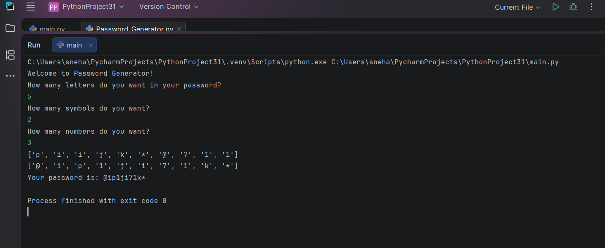

# 🔐 Python Password Generator

## 📖 Description

This is a simple Python Password Generator that creates a strong and random password based on the user's requirements.

The user can choose:
- Number of letters
- Number of symbols
- Number of numbers

The program then generates a random password and shuffles the characters for better security.

---

## ✨ Features

- Random password generation
- User-defined password length
- Includes letters, numbers, and symbols
- Randomly shuffles characters
- Beginner-friendly Python project

---

## 🛠️ Technologies Used

- Python 3
- Random Module

---

## 📂 Project Structure

```
Password-Generator/
│── password_generator.py
│── README.md
│── output.png
```

---

## ▶️ How to Run

1. Clone this repository.

```
git clone https://github.com/your-username/Python-Password-Generator.git
```

2. Open the project folder.

3. Run the program.

```
python password_generator.py
```

---

## 📸 Output



---

## 📚 Concepts Used

- Variables
- Lists
- Loops
- User Input
- Random Module
- String Manipulation
- List Operations

---

## 🎯 Learning Outcome

This project helps beginners understand how to:

- Generate random values
- Work with lists
- Use loops
- Accept user input
- Build a complete Python application

---


