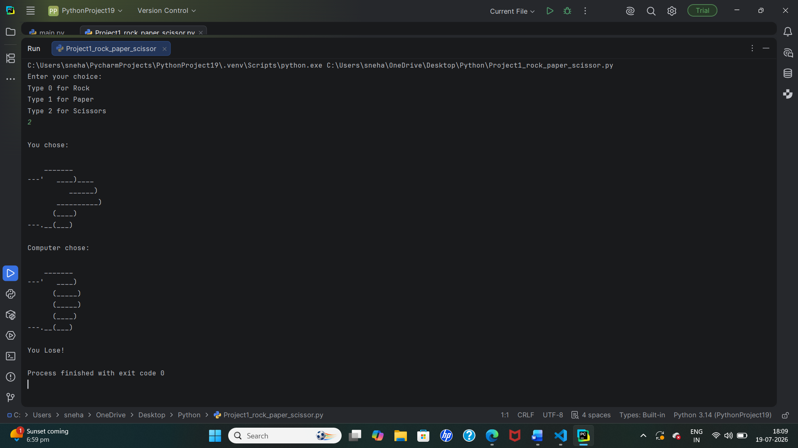
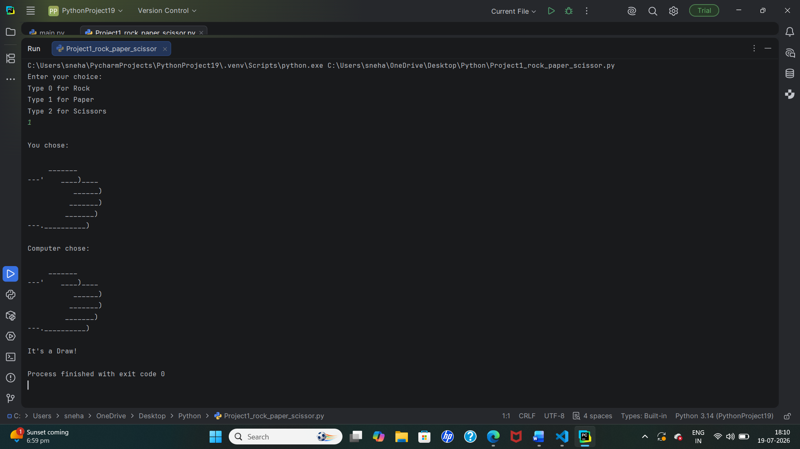

<p align="center">
  
  
  
</p>

<h1 align="center">🎮 Rock Paper Scissors Game</h1>

<p align="center">
A simple command-line <b>Rock Paper Scissors</b> game built using Python. Challenge the computer and see if you can win!
</p>

---

## 📌 Description

This project is a beginner-friendly Python game where the user plays **Rock, Paper, Scissors** against the computer.

The computer randomly selects its move, and the program determines the winner based on the game rules.

---

## ✨ Features

- 🪨 Rock, 📄 Paper, ✂️ Scissors gameplay
- 🎲 Random computer choice
- 🖥️ ASCII art display
- ✅ Input validation
- 🏆 Win, Lose, and Draw results
- 💻 Beginner-friendly Python project

---

## 🛠️ Technologies Used

- Python 3
- Random Module

---

## 📂 Project Structure

```
Rock-Paper-Scissors/
│── rock_paper_scissors.py
│── README.md
│── output.png
```

---

## ▶️ How to Run

1. Clone the repository

```bash
git clone https://github.com/your-username/Rock-Paper-Scissors.git
```

2. Navigate to the project folder

```bash
cd Rock-Paper-Scissors
```

3. Run the program

```bash
python rock_paper_scissors.py
```

---

## 🎮 Game Rules

- Rock 🪨 beats Scissors ✂️
- Scissors ✂️ beats Paper 📄
- Paper 📄 beats Rock 🪨
- Same choice results in a Draw 🤝

---

## 📷 Output





---

## 📚 Learning Outcomes

- Variables
- Lists
- Conditional Statements (`if`, `elif`, `else`)
- User Input
- Random Module
- Python Functions
- Basic Game Logic

---

## 🚀 Future Improvements

- Play multiple rounds
- Keep score
- Add emojis
- GUI version using Tkinter
- Sound effects

---

## ⭐ Support

If you like this project, don't forget to **Star ⭐ the repository** and share it with others.

Happy Coding! 🚀
