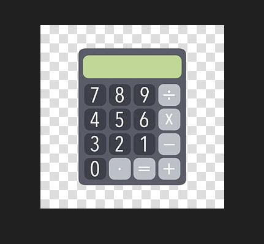
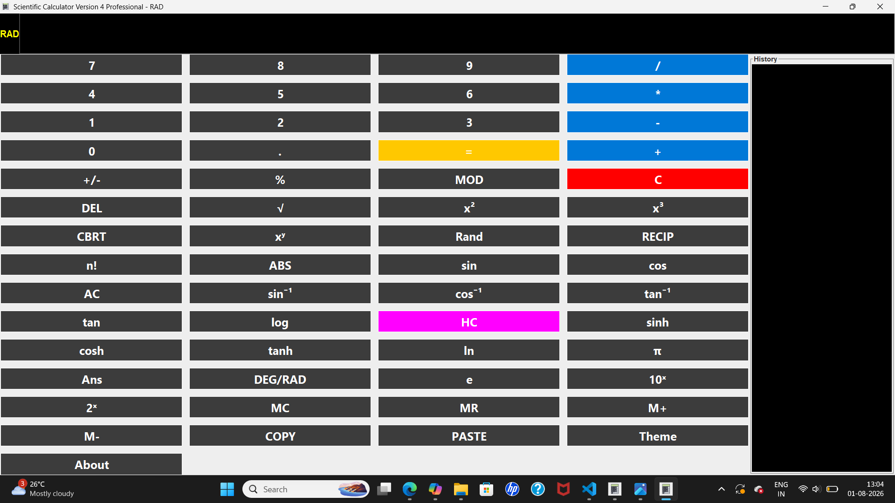
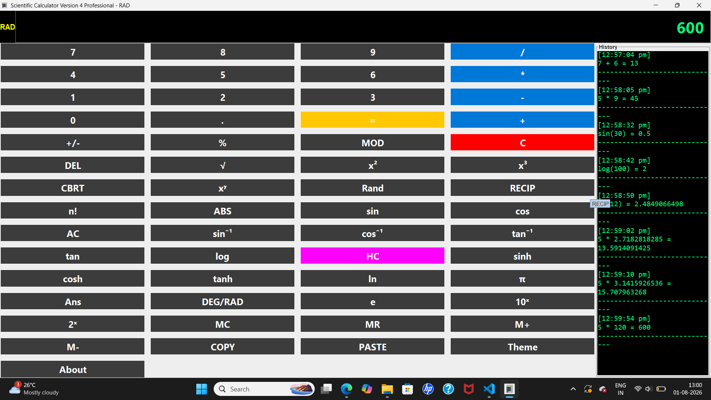
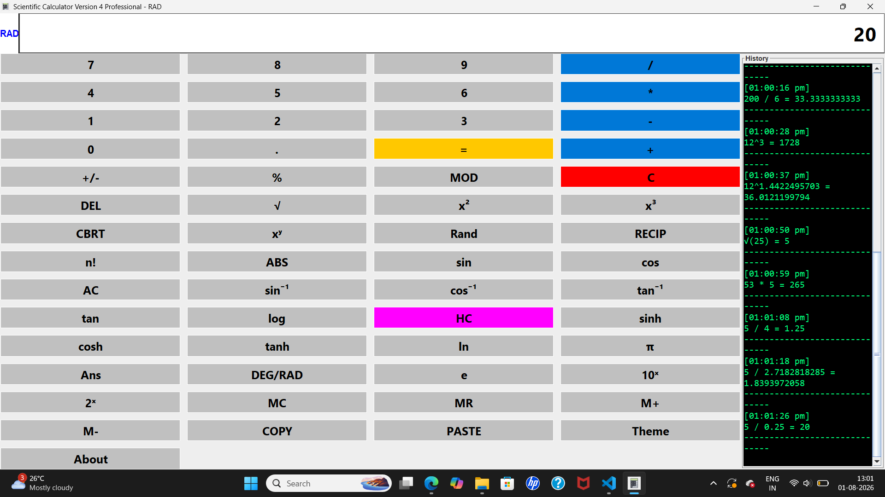

# 🧮 Scientific Calculator V4 Professional


A professional desktop Scientific Calculator developed using **Java** and **Java Swing**. The application provides basic arithmetic operations, advanced scientific functions, memory operations, keyboard shortcuts, clipboard support, history tracking, and Dark/Light theme support with an interactive graphical user interface.


## 📸 Application Screenshot



---

## 📌 Project Information

- **Project Name:** Scientific Calculator V4 Professional
- **Language:** Java
- **GUI Framework:** Java Swing
- **IDE:** Visual Studio Code / Eclipse / NetBeans
- **Java Version:** JDK 17 or above

---

## ✨ Features

### Basic Calculator

- Addition
- Subtraction
- Multiplication
- Division
- Modulus
- Decimal Support
- Positive/Negative Toggle
- Delete Last Character
- Clear
- All Clear

### Scientific Functions

- Square Root
- Cube Root
- Square
- Cube
- Power (xʸ)
- Reciprocal (1/x)
- Factorial
- Absolute Value
- Percentage
- Logarithm (log)
- Natural Logarithm (ln)
- 10ˣ
- 2ˣ

### Trigonometric Functions

- sin
- cos
- tan
- sin⁻¹
- cos⁻¹
- tan⁻¹

Supports:

- Degree Mode
- Radian Mode

### Hyperbolic Functions

- sinh
- cosh
- tanh

### Constants

- π (Pi)
- e (Euler Number)
- Random Number Generator

### Memory Functions

- MC
- MR
- M+
- M-

### Other Features

- History Panel
- Copy Result
- Paste Number
- Keyboard Shortcuts
- Dark Theme
- Light Theme
- About Dialog
- Professional GUI

---

## 🖥️ User Interface

The application consists of:

- Display Screen
- Scientific Button Panel
- History Panel
- Degree/Radian Indicator
- Dark/Light Theme Support

---

## ⌨️ Keyboard Shortcuts

| Shortcut | Action |
|----------|--------|
| Enter | Calculate |
| Backspace | Delete |
| Esc | Clear |
| Ctrl + C | Copy |
| Ctrl + V | Paste |
| S | sin |
| O | cos |
| T | tan |
| R | Square Root |
| L | log |

---

## 📷 Screenshots

### Main Window



### Dark Theme



### Light Theme



---

## 📂 Project Structure

```text
ScientificCalculatorV4/
│
├── ScientificCalculatorV4.java
├── calculator.png
├── README.md
├── images/
│   ├── calculator.png
│   ├── dark-theme.png
│   └── light-theme.png
```

---

## 🚀 How to Run

### Clone the Repository

```bash
git clone https://github.com/your-username/ScientificCalculatorV4.git
```

### Open the Project

Open the project using:

- Visual Studio Code
- Eclipse
- NetBeans

### Compile

```bash
javac ScientificCalculatorV4.java
```

### Run

```bash
java ScientificCalculatorV4
```

---

## 📋 Sample Output

```
25 + 10 = 35

√81 = 9

sin(30) = 0.5

log(1000) = 3

5^3 = 125
```

---

## 💡 Future Improvements

- Scientific Notation
- Matrix Calculator
- Unit Converter
- Currency Converter
- Graph Plotter
- Save History to File
- Expression Display
- Menu Bar
- Precision Settings

---

## 👩‍💻 Developer

**Sneha S**

Electronics and Communication Engineering (ECE)

University BDT College of Engineering, Davangere

---

## 📄 License

This project is developed for educational and learning purposes.

© 2026 Sneha S. All Rights Reserved.
