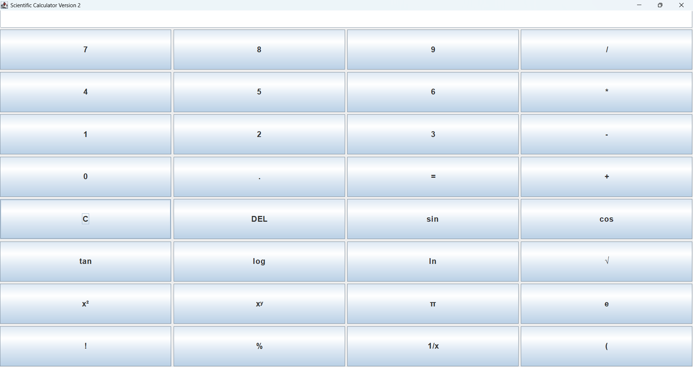

# 🧮 Scientific Calculator GUI

<div align="center">


</div>

---

## 📌 Project Overview

The **Scientific Calculator GUI** is a desktop application developed using **Java Swing**. It provides a user-friendly graphical interface to perform both **basic arithmetic** and **scientific mathematical operations**.

The calculator is designed with interactive buttons, a display panel, and supports multiple scientific functions, making it suitable for students and beginners learning Java GUI development.

---

## 🚀 Features

### ➕ Basic Operations
- Addition
- Subtraction
- Multiplication
- Division

### 🔬 Scientific Operations
- Sin
- Cos
- Tan
- Logarithm (log)
- Natural Log (ln)
- Square Root (√)
- Square (x²)
- Power (xʸ)
- Reciprocal (1/x)
- Percentage (%)
- Factorial (!)
- Pi (π)
- Euler's Number (e)

### 🛠 Utility Functions
- Decimal Numbers
- Clear (C)
- Delete (DEL)
- Result (=)

---

## 🖥 Technologies Used

- Java
- Java Swing
- AWT Event Handling
- Object-Oriented Programming (OOP)

---

## 📂 Project Structure

```
ScientificCalculatorGUI.java
README.md
```

---

## ▶ How to Run

### 1. Compile

```bash
javac ScientificCalculatorGUI.java
```

### 2. Execute

```bash
java ScientificCalculatorGUI
```

---

## 📸 Calculator Interface

> Add your application screenshot here.

```
Project Folder
│
├── screenshots
│     └── calculator.png
```
## Output Screenshot




## 📖 Concepts Used

- Java Swing Components
- JFrame
- JButton
- JTextField
- JPanel
- GridLayout
- BorderLayout
- ActionListener
- Event Handling
- Mathematical Functions
- Exception Handling
- Methods
- Loops
- Conditional Statements

---

## 🎯 Learning Outcomes

After completing this project, you will understand:

- GUI development using Java Swing
- Event-driven programming
- Object-Oriented Programming concepts
- Mathematical calculations using Java Math library
- Handling user inputs
- Exception handling
- Building desktop applications

---

## 🔮 Future Enhancements

- Memory Functions (MC, MR, M+, M-)
- Calculation History
- Dark Mode
- Keyboard Input Support
- Expression Evaluation (e.g., 5+2×3)
- Scientific Notation
- Degree/Radian Toggle
- Themes and Custom Colors

---

## 👩‍💻 Author

**Sneha S**  
B.E. Electronics and Communication Engineering

---

## ⭐ Support

If you found this project useful, don't forget to **Star ⭐ the repository** and share your feedback.

---

<div align="center">

### 🚀 Happy Coding! 💻

</div>
