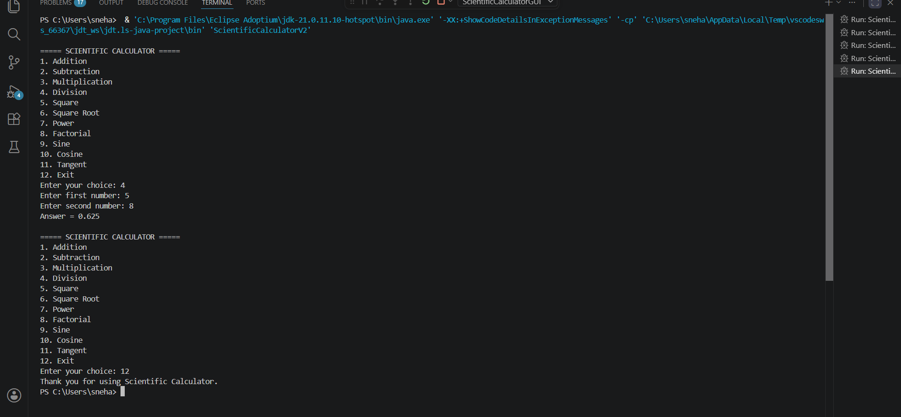

# 🧮 Scientific Calculator V2 (Java)

<p align="center">


</p>

A **Scientific Calculator V2** developed using **Java**. This enhanced console-based calculator allows users to perform multiple calculations in a single execution using a menu-driven interface with loop control.

---

# ✨ Features

## ➕ Basic Operations

- Addition
- Subtraction
- Multiplication
- Division

## 🔬 Scientific Operations

- Square
- Square Root
- Power (xʸ)
- Factorial
- Sine (sin)
- Cosine (cos)
- Tangent (tan)

## 🚀 Version 2 Improvements

- Menu-driven interface
- Multiple calculations without restarting the program
- Continuous execution using `do-while` loop
- Exit option
- Input validation for division and square root
- User-friendly console output

---

# 🛠 Technologies Used

- Java
- Scanner Class
- Math Class
- Switch Case
- do-while Loop

---

# 📁 Project Structure

```
ScientificCalculatorV2/
│── ScientificCalculatorV2.java
│── README.md
│── output.png
```

---

# ⚙ Requirements

- Java JDK 8 or above
- VS Code / Eclipse / IntelliJ IDEA / NetBeans

---

# ▶️ How to Run

### Compile

```bash
javac ScientificCalculatorV2.java
```

### Run

```bash
java ScientificCalculatorV2
```

---

# 📋 Menu

```
===== SCIENTIFIC CALCULATOR =====

1. Addition
2. Subtraction
3. Multiplication
4. Division
5. Square
6. Square Root
7. Power
8. Factorial
9. Sine
10. Cosine
11. Tangent
12. Exit
```

---

# 💻 Sample Output

```
===== SCIENTIFIC CALCULATOR =====

Enter your choice: 7

Enter base: 2
Enter exponent: 8

Answer = 256.0

===== SCIENTIFIC CALCULATOR =====

Enter your choice: 12

Thank you for using Scientific Calculator.
```

---

# 🛡 Input Validation

- Prevents division by zero.
- Prevents square root of negative numbers.
- Displays **"Invalid Choice"** for incorrect menu selections.
- Keeps the calculator running until the user selects **Exit**.

---

# 📸 Output Screenshot



---
# 📚 Java Concepts Used

- Variables and Data Types
- Scanner Class
- Switch Case
- do-while Loop
- for Loop
- Conditional Statements (`if-else`)
- Java Math Library (`Math`)
- User Input Handling
- Console-Based Programming

---

# 🎯 Learning Outcomes

This project demonstrates:

- Menu-driven Java application development
- Loop-based program execution
- Mathematical computations using the `Math` class
- Decision making with `switch` statements
- User input validation
- Console application design

---

# 🔮 Future Enhancements

- Java Swing GUI Version
- Scientific expression evaluation
- Calculation history
- Memory functions
- Percentage operation
- Logarithm and Natural Log
- Reciprocal (1/x)

---

# 👩‍💻 Author

**Sneha S**

🎓 B.E. Electronics and Communication Engineering

🏫 University BDT College of Engineering, Davangere

---

# ⭐ Support

If you found this project useful, please consider giving it a **⭐ Star** on GitHub!

Happy Coding! 🚀
